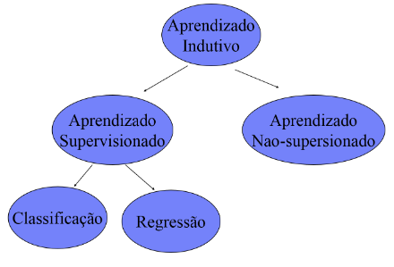
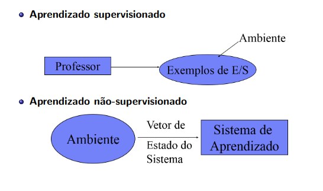
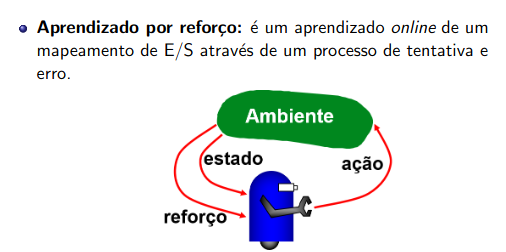

# Sistemas de Aprendizado
Em ML não existe um único algoritmo que funcione melhor para todos os tipos de problemas. Cada método tem seus pontos fortes e limitações, dependendo do contexto em que é aplicado.
Por isso, é essencial avaliar diferentes algoritmos de forma estruturada, utilizando metodologias que permitam entender como eles se comportam em situações específicas. Issoa ajuda a escolher a melhor abordagem para cada problema e a interpretar corretamente os resultados obtidos. 

## Aprendizado Indutivo
A indução é um tipo de raciocínio que permite tirar conclusões gerais a partir de exemplos específicos. No aprendizado, o modelo observa dados e, com base neles, cria hipóteses, que nem sempre são totalmente verdadeiras, mas servem como aproximações. 
**OBS:** O modelo gerar alguma hipótese significa que ele induziu um padrão, ou seja, a "hipótese" é basicamente a função que o modelo aprende, por exemplo, uma reta na regressão. 
##### ATENÇÃO: Se o número de exemplos for insuficiente ou se os exemplos não forem bem escolhidos, teremos um modelo que não reflete as características do domínio. 

O aprendizado indutivo pode ser:
- Supervisionado.
- Não supervisionado

### 1) Aprendizado Supervisionado
No aprendizado supervisionado, o modelo é treinado com dados que já possuem respostas conhecidas (**dados rotulados - Labels**). Cada exemplo contém características (entrada) e a classe correspondente (saída), que é a **nossa variável alvo/resposta/variável dependente**.
O objetivo é fazer com que o modelo aprenda a relação entre entrada e saída, para depois conseguir classificar corretamente novos dados que ainda não possuem rótulo. 

### 2) Aprendizado não-supervisionado
No aprendizado não=supervisionado, o modelo recebe os dados de treinamento sem respostas ou classificações previamente definidas. Assim, ele analisa as características dos exemplos e identifica possível semelhanãs entre eles, organizando-os em grupos, chamados clusters.
Depois que esses agrupamentos são formados, é necessário analisar e interpretar o resultado, de modo a entender o que cada grupo representa. Por exemplo, em uma base de clientes, o algoritmo pode separar pessoas com comportamentos de compra semelhantes, mas cabe à análise posterior descobrir o perfil de cada grupo. 

## Paradigmas de aprendizado

No aprendizado supervisionado, existe a figura de um professor, ou seja, os dados de treinamento já fornecem exemplos deentrada e a saída correta esperada. Nesse caso, o sistema aprende a relação entre essas entradas e saídas para, posteriormente, prever a resposta de novos dados. 
No aprendizado não-supervisionado, o sitema recebe apenas informações do ambiente, representadas pelo vetor de estado do sistema, sem que alguém informe a resposta correta. A partir desses dados, ele tenta identificar padrões, semelhanças ou agrupamentos existentes. 

## Referências
https://www.youtube.com/watch?v=dPL3eZNjsMs&list=PLvlkVRRKOYFR6_LmNcJliicNan2TYeFO2&index=2

## Bibliotecas
https://scikit-learn.org/stable/index.html