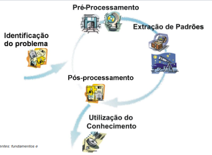
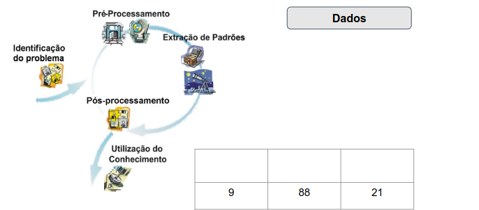
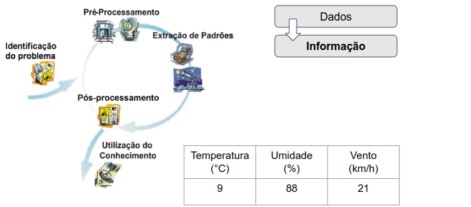
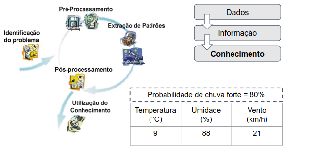
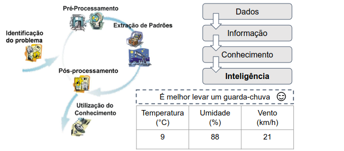
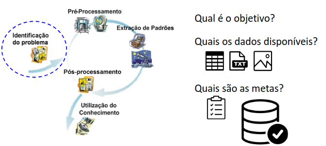
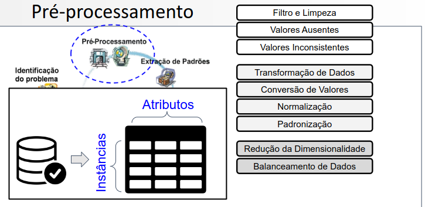
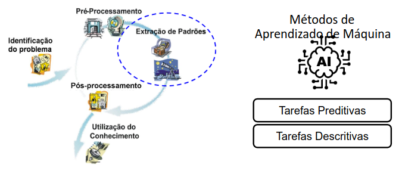
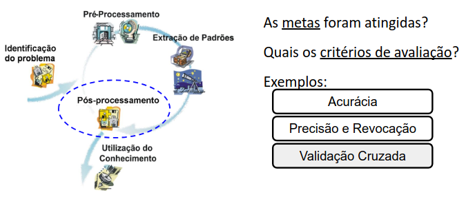
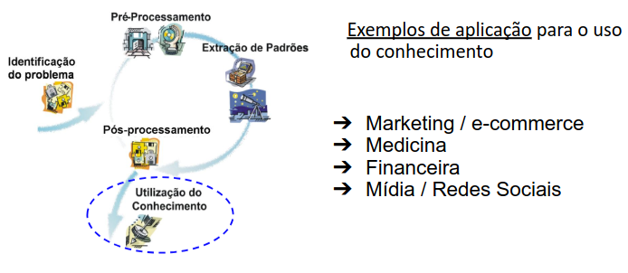

# Mineração de Dados

Vamos entender: 
- O que é Mineração de Dados (MD)?
- Quais as etapas envolvidas no processo de MD? 

## O que é? 
A Mineração de Dados (MD) é o processo de analisar grandes conjuntos de dados para descobrir informações úteis, como padrões, tendências ou comportamentos que não são percebidos facilmente apenas observando os dados brutos.
Um exemplo seria prever comportamentos futuros ou detectar situações incomuns. 

## Processo de Mineração de Dados

O **objetivo** é a extração de conhecimento útil e interessante a partir de dados, para a utilização em um processo de tomada de decisão. 

O processo de Mineração de Dados transforma registros brutos em conhecimento útil para tomar decisões. Por exemplo, podemos ter os números `9`, `88` e `21`, que são apenas dados, pois não se sabe o que representam. Quando esses valores recebem contexto, como **temperatura de 9°C, umidade de 88% e vento de 21km/h**, passam a constituir uma informação. Sendo assim, a partir da análise dessas informações e de padrões encontrados em exemplos anteriores, pode-se obter um conhecimento, como a previsão de que a probabilidade de chuva forte é de 80%. 
Por fim, a inteligência corresponde ao uso prático desse conhecimento para tomar um decisão. No nosso exemplo, pode ser que sabendo que há alta chance de chuva, é melhor levar um guarda-chuva. 

### Identificação do problema

### Pré-processamento

Os atributos pode ser visto como o perfil de um consumidor, enquanto as intâncias são os próprios consumidores. 

### Extração de padrões

Tarefas preditivas (exemplos):
- Naive Bayes
- Árvores de Decisão
- Random Forest
- SVM

Nas preditivas, temos a classificação e a regressão. 

Tarefas descritivas (exemplo):
- Agrupamento de Dados
- Regras de Associação

### Pós-processamento

### Utilização do conhecimento
