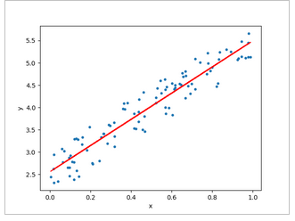
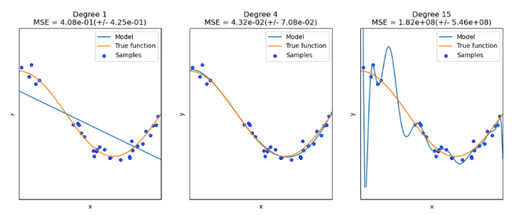
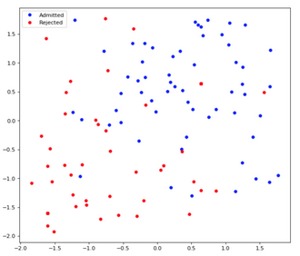
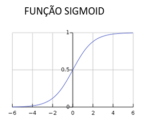
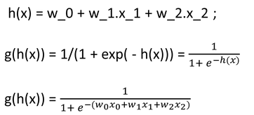

# Regressão Multivariada e Logística

Na regressão, vamos aproximar pontos por uma reta. 

## Regressão Linear Univariada


A regressão linear univariada é uma técnica de aprendizado supervisionado utilizada para prever um valor numérico de saída (Y) a partir de uma única variável de entrada (X). O termo univariada indica justamente que existe apenas uma variável sendo usada para fazer a previsão.
No gráfico, os pontos azuis representam os exemplos conhecidos da base de dados, formados por pares de entrada e saída, como $X = 0,2$ associado a $Y = 3,0$. A linha vermelha representa a reta que melhor aproxima o comportamento geral desses pontos.
Essa reta é descrita pela equação:

$$
Y=W⋅X+B
$$

Nessa equação, $W$ representa a inclinação da reta, indicando quanto o valor de $Y$ tende a mudar quando $X$ aumenta. Já $B$ representa o ponto em que a reta intercepta o eixo $Y$, ou seja, o valor inicial previsto quando $X = 0$. 

O **objetivo** do aprendizado é encontrar os valores adequados de $W$ e $B$ para que a reta produza previsões o mais próximas possível dos valores reais observados nos dados. Depois de aprendida, essa relação pode ser usada para estimar $Y$ para novos valores de $X$.

Na regressão linear univariada, temos o método dos mínimos quadrados para gerar a reta que melhor se aproxima dos dados. 

##### Atenção: Queremos sempre reduzir o erro quadrático. 


## Regressão Linear Multivariada
A regressão linear multivariada é uma extensão da regressão linear univariada. Em vez de prever a saída $Y$ utilizando apenas uma variável $X$, o modelo utiliza várias características de entrada:

$$
X=(X_0​,X_1​,X_2​,...,X_n​)
$$

Por exemplo, para prever o preço de uma casa, podem ser consideradas simultaneamente variáveis como área, número de quartos, localização e idade do imóvel.
Nesse caso, $W$ deixa de ser um único valor e passa a ser um vetor de pesos. Cada variável de entrada terá seu próprio peso, indicando o quanto ela contribui para a previsão final:

$$
\hat{Y} = X W
$$

Assim como na regressão univariada, o objetivo é encontrar os pesos que minimizam a diferença entre os valores reais e os valores previstos. A solução matricial é a equação normal:

$$
W = (X^{T}X)^{-1}X^{T}Y
$$

## Métricas de Regressão
- MSE (Mean Square Error)
- MAE (Mean Absolute Error)
- $R²$ (Medida $R²$)


### 1 - Mean Square Error (MSE)
Essa métrica calcula, em média, o quanto os valores previstos pelo modelo se distanciam dos valores reais.

$$
\mathrm{MSE} = \frac{1}{n} \sum_{i=0}^{n-1} \left(y_i - \hat{y}_i\right)^2
$$

$y_i$ representa o valor real do exemplo, enquanto $\hat{y_i}$ representa o valor previsto pelo modelo. 
A diferença entre eles é o erro de previsão. 
**OBS:** Esse erro é elevado ao quadrado para eliminar sinais negativos e dar maior importância a previsões muito distantes do valor correto.
Sendo assim, quanto menor for o MSE, melhor o modelo está ajustado aos dados. 
- Um MSE igual a zero indicaria que todas as previsões coincidem exatamente com os valores reais. 

**OBS2:** Como os erros são elevados ao quadrado, o MSE pode ser bastante afetado por erros muito grandes.


### 2- Mean Absolute Error (MAE)
A diferença desse para o MSE, é que aqui é usada a média absoluta. 

$$
\mathrm{MAE} = \frac{1}{n} \sum_{i=0}^{n-1} \left| y_i - \hat{y}_i \right|
$$

Quanto menor for o MAE, melhores são as previsões do modelo


### 3 - $R²$
A medida $R²$, chamada de **coeficiente de determinação**, indica o quanto o modelo de regressão consegue explicar a variação dos dados reais. Em outras palavras, ela mostra se as previsões feitas pelo modelo acompanham bem o comportamento observado na base de dados.
A fórmula usual do $R²$ utiliza, no numerador, o erro das previsões e, no denominador, a variação dos valores reais em relação à média:
Nessa métrica, $y_i$ representa o valor real, $\hat{y}_i$ representa o valor previsto pelo modelo e $\bar{y}$ representa a média dos valores reais. A ideia é comparar o erro das previsões com a variação que já existe naturalmente nos dados.
A fórmula usual do $R^2$ é:

$$
R^2 = 1 - \frac{\sum_{i=0}^{n-1} \left(y_i - \hat{y}_i\right)^2}{\sum_{i=0}^{n-1} \left(y_i - \bar{y}\right)^2}
$$

##### Atenção:
- Quanto mais próximo de 1 for o valor de $R²$, melhor o ajuste do modelo, pois significa que ele explica grande parte da variação dos dados. 
- Um valor próximo de 0 indica que o modelo não é muito melhor do que simplesmente prever a média dos valores observados. Em alguns casos, 
- Se for negativo, indica um ajuste ainda pior do que utilizar a média como previsão.


## Underfitting e Overfitting



## Implementação Regressão Linear

```python
from sklearn import linear_model
reg = linear_model.LinearRegression()
reg.fit([[0, 0], [1, 1], [2, 2]], [0, 1, 2])
reg.coef_
reg.intercept_
```

##### Seção da biblioteca
https://scikit-learn.org/stable/modules/linear_model.html#ordinary-least-squares


## Regressão Logística
Apesar do nome regressão, a regressão logística é uma técnica utilizada principalmente em problemas de classificação. Nesse caso, o **objetivo** não é prever um valor contínuo, como um preço ou uma temperatura, mas decidir a qual classe um exemplo pertence.



Nesse caso, deseja-se classificar estudantes em duas categorias, sendo elas aprovados ou não aprovados no vestibular.
A regressão logística analisa esses dados e aprende uma separação entre as duas classes. Dessa forma, para um novo estudante, o modelo calcula a probabilidade de ele pertencer a uma das categorias, como a probabilidade de ser aprovado. A partir de um limite, normalmente 50%, a previsão final é convertida em uma classe: 
- aprovado 
- ou não aprovado.

##### Diferença entre Linear e Logística
Enquanto a regressão linear prevê valores numéricos contínuos, a regressão logística é usada para prever categorias, especialmente em problemas com duas classes, chamados de classificação binária.

Na regressão linear, o modelo calcula diretamente: 

$$
\hat{y} = w_0 x_0 + w_1 x_1 + \cdots + w_n x_n + b
$$

E o resultado pode ser um número qualquer. Isso funciona muito bem para prever valores contínuos, como preço, temperatura ou salário. 

Na regressão logística, inicialmente também é calculada uma combinação linear:

$$
z = w_0 x_0 + w_1 x_1 + \cdots + w_n x_n + b
$$

Porém, esse valor $z$ não é usado diretamente como resposta final. Na realidade, ele passa por uma função a mais, na qual faz a saída ficar limitada entre 0 e 1, podendo ser interpretada como uma probabilidade ou pertecente a um grupo. 

### Funções da Regressão Logística


$$
g(x) = \frac{1}{1 + e^{-x}}
$$

Na regressão logística, o valor obtido pela sigmoide pode ser interpretado como uma probabilidade. 
**Por exemplo**, se o modelo calcular $g(x)=0,8$, isso pode indicar uma probabilidade de 80% de um estudante ser aprovado no vestibular.
A partir dessa probabilidade, define-se uma regra de classificação. Geralmente, quando o resultado é maior ou igual a 0,5, o exemplo é classificado na classe positiva, como aprovado e, quando o resultado é menor que 0,5, ele é classificado na classe negativa, como não aprovado.

Existem outras funções, e o importante delas é transformar o número, o qual foi obtido pela regressão linear, em uma classe 0 ou 1 (classificação binária). 

##### Outras funções


## Implementação da Regressão Logística 

```python
from sklearn.datasets import load_iris
from sklearn.linear_model import LogisticRegression
X, y = load_iris(return_X_y=True)
clf = LogisticRegression(random_state=0).fit(X, y)
clf.predict(X[:2, :])
clf.predict_proba(X[:2, :])
clf.score(X, y)
```

##### Seção da biblioteca
https://scikit-learn.org/stable/modules/generated/sklearn.linear_model.LogisticRegression.html#sklearn.linear_model.LogisticRegression


## Regularização 
A regularização é uma técnica utilizada para evitar que um modelo de regressão fique excessivamente complexo ou dependente demais dos dados utilizados no treinamento. Essa técnica acrescenta uma penalização aos parâmetros do modelo, especialmente aos pesos muito grandes, de modo a incentivar soluções mais simples e com maior capacidade de funcionar bem em novos dados.
Em modelos com muitas variáveis, algumas características podem ter pouca importância ou gerar instabilidade nas previsões. Dessa forma, a regularização ajuda a diminuir a influência dessas variáveis e, em alguns casos, pode fazer com que certas variáveis sejam desconsideradas pelo modelo.

Com isso, o modelo tende a apresentar menor variância, maior generalização, isto é, passa a variar menos quando treinado com conjuntos de dados diferentes. 
**OBS:** Essa técnica é especialmente importante para reduzir o risco de overfitting. 

Dois tipos principais de regularização:
- L1, que pode levar alguns pesos exatamente a zero, realizando uma espécie de seleção de variáveis;
- L2, que reduz os valores dos pesos, tornando o modelo mais estável, mas geralmente sem eliminar completamente variáveis.


### Algoritmo LASSO e RIDGE 
Os algoritmos LASSO e RIDGE são modelos de regressão que utilizam regularização para controlar a complexidade do modelo e reduzir o risco de overfitting.

A **Regressão LASSO** utiliza a regularização L1, que adiciona uma penalização baseada na soma dos valores absolutos dos pesos:

$$
\text{Erro} + \lambda \sum_{j=1}^{n} \left| w_j \right|
$$

Essa penalização pode fazer com que alguns pesos se tornem exatamente iguais a zero. Por isso, o LASSO pode ser usado para **selecionar variáveis**, eliminando características que contribuem pouco para a previsão.

Já a **Regressão RIDGE** utiliza a regularização L2, que penaliza a soma dos quadrados dos pesos:

$$
\text{Erro} + \lambda \sum_{j=1}^{n} w_j^2
$$

Nesse caso, os pesos tendem a diminuir, mas geralmente não chegam exatamente a zero. Assim, o RIDGE mantém as variáveis no modelo, reduzindo sua influência e tornando as previsões mais estáveis.
Além disso, **em ambos os casos**, o parâmetro λ controla a intensidade da regularização, ou seja, quanto maior seu valor, maior será a penalização imposta aos pesos e mais simples tende a ser o modelo.

**OBS:** Normalmente, quando queremos punir os outliers, usamos o modelo L2. 